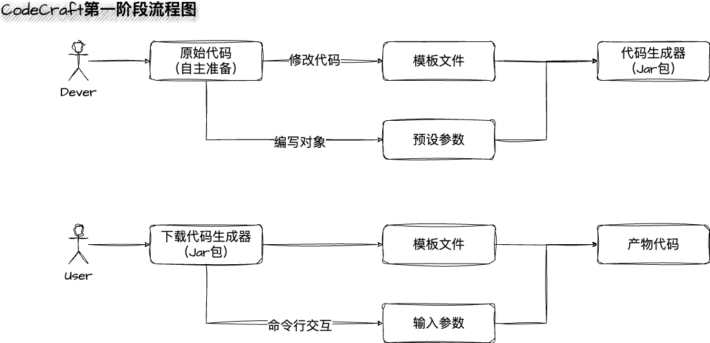
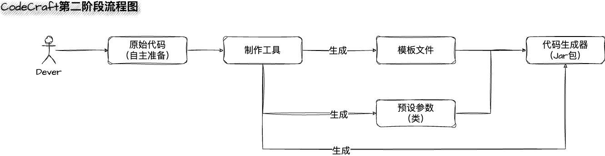
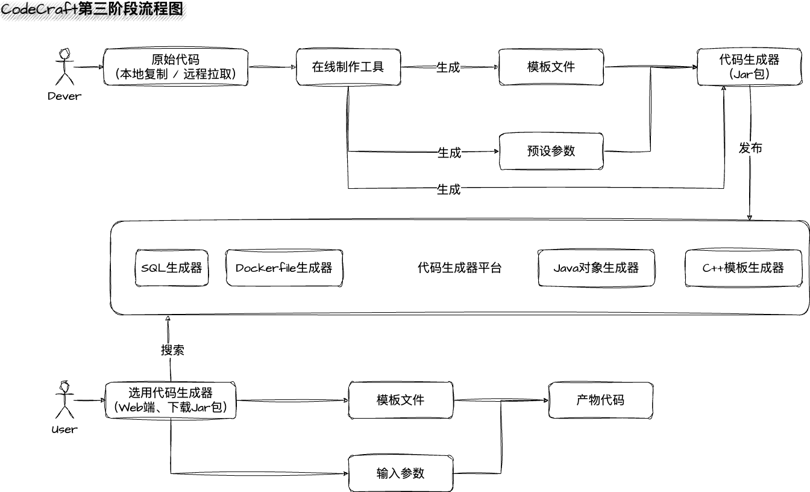

# Code Craft

> Build Your Own Code Generator!
>
> [ZH-CN Doc](doc/README-CN.md)

## Introduction

**Customized code generation project** based on React + SpringBoot + Vert.x reactive programming.


### Project Background

#### Problem to Solve

1. The role of a code generator is to generate common and repetitive code snippets, addressing the issues of repetitive coding and low efficiency.
2. Although there are many code generators available online, they are often unable to meet the customization requirements of actual development, such as adding specific annotations and comments to each class. (This is why many developers complain about constantly copying and pasting code, writing repetitive code, and dealing with CRUD operations every day.) If there is a tool that can help developers quickly customize their own code generators, it will further improve development efficiency.
3. In team development, the required generated code may be subject to frequent changes and continuous updates. If there is an online platform to maintain multiple different code generators, supporting online editing and sharing of generators, it will not only improve development efficiency but also promote collaboration and the creation of higher quality code generators.

#### Practical Applications

Here are some examples of actual use cases for code generation that we will address through this project:

1. Coder who frequently practices algorithmic problems may need an ACM (Algorithmic Competitions) code template that supports various input modes, such as word reading and loops.
2. Coder who frequently starts new projects may need an initialization project template, such as generating controller code with object replacements, integrating Redis, MySQL dependencies, etc.
3. A project "re-skinning" tool can be developed to support one-click rebranding of popular internet projects (such as replacing project names, logos, etc.).

## Requirements Analysis

### Research

There are several code generator projects available online, such as the backend project scaffolding in the front-end [Ant Design Pro](https://pro.ant.design/) which allows users to interactively create specified projects, and the [MyBatisX](https://baomidou.com/pages/ba5b24/) plugin for backend development that allows users to create CRUD code through a user interface. However, these projects are pre-made code generators that require Coders to generate code based on their predefined rules, and the generated code often needs to be further modified. They lack flexibility.

There are also many so-called code generation projects that are essentially ready-made project templates, which require users to use configuration files to use the projects or are based on predefined programs to generate specific code, such as many well-known open-source content management systems available online.

These projects differ from what we aim to achieve. Our goal is to take it a step further! We want to develop a tool that helps Coders quickly create their own code generators, which can be considered as creating "wheels for making wheels".

Furthermore, we will take it to the next level by allowing users to publish and manage their code generators on an online platform, making it easier to share and collaborate!

### Process

Requirements Analysis => Design (High-level Design, Detailed Design) => Technology Selection => Project Initialization / Integration of Required Technologies => Demo Development => Actual Development (Implementation of Business Logic) => Testing (Unit Testing, System Testing) => Code Commit / Code Review => Deployment => Release

## Project Design

### Core Principle of Code Generators

**`Parameters + Template Files => Generated Complete Code`**

【🌰 Example】

Parameters: `author = youyi`

Template file code:

```html
--------------
I am ${author}
--------------
```

By injecting the parameters into the template file, we get the generated complete code:

```html
--------------
I am youyi
--------------
```

To use this template to generate other code, we only need to modify the value of the parameters, without changing the template file itself.

### Three Phases

1. Phase One: Creating a `Local Code Generator`, which is a command-line interface (CLI) tool that allows users to interactively input parameters and quickly generate specific code.
2. Phase Two: Developing a `Code Generator Creation Tool`, which enables developers to quickly transform a fixed project code into a dynamic template that can be customized.
3. Phase Three: Developing an `Online Code Generator Platform`, which can be seen as an application marketplace for code generators. Anyone can publish, use, and even create their own code generators online.

#### Phase One - Local Code Generator

Objective: Develop a local (offline) code generator, which is a simple Java ACM template project customized generator based on a command-line interface.

##### Business Process

1. Prepare the original code used to create the code generator (e.g., Java ACM template project) for subsequent generation.
2. Developers set parameters and write dynamic templates based on the original code.
3. Develop an interactive command-line tool that supports user input of parameters to generate the code generator jar package.
4. Users obtain the code generator jar package, execute the program, and input parameters to generate complete code.

##### Flowchart



##### Implementation Approach

1. Scan the file tree based on the local project to implement static code generation.
2. Define dynamic parameters and write template files based on the local project, implementing dynamic code generation by injecting configuration objects.
3. Develop an interactive command-line tool that accepts user input parameters and dynamically generates code.
4. Create a packaged jar file that encapsulates the code generator and simplify the command for easy usage.

##### Key Questions

1. How to generate the same set of code based on a project's file tree?
2. How to write dynamic template files? How to generate code based on the template and parameters?
3. How to create a command-line tool? How to interactively accept user input?
4. How to package the command-line tool as a JAR file? How to simplify the command for ease of use?

#### Phase Two - Code Generator Creation Tool

Objective: Develop a local code generator creation tool that allows developers to quickly transform a fixed project code into a code generator with customizable parts.

##### Business Process

1. Prepare the original code used to create the code generator (e.g., a Java project) for subsequent transformation.
2. Developers use the code generator creation tool to set parameters and generate dynamic templates based on the original code.
3. Develop a user-friendly graphical interface for the code generator creation tool, allowing developers to easily customize the code generator.
4. Generate a code generator package that includes the dynamic templates and configuration files.
5. Users obtain the code generator package, import it into their development environment, and use it to generate code by setting parameters and selecting templates.

##### Flowchart



##### Implementation Approach

1. Develop the code generator creation tool as a standalone application with a user-friendly GUI.
2. Allow developers to import their existing projects into the code generator creation tool.
3. Provide features to set parameters, define dynamic templates, and preview generated code.
4. Generate the code generator package, which includes the dynamic templates, configuration files, and necessary scripts.
5. Provide export options to generate the code generator package as a downloadable file for users.

##### Key Code Considerations

1. How to analyze the structure and code components of an existing project for transformation?
2. How to provide a user-friendly GUI for developers to set parameters and create dynamic templates?
3. How to generate the code generator package with all necessary files and scripts for code generation?
4. How to export the code generator package as a downloadable file for users?


#### Phase Three - Online Code Generator Platform

Objective: Develop an online platform for code generators, where users can publish, discover, and use code generators created by themselves and other community members.

##### Business Process

1. Developers can register an account on the online platform and create code generators using the code generator creation tool.
2. Developers can publish their code generators on the platform, providing descriptions, tags, and documentation.
3. Users can browse and search for code generators based on different criteria (e.g., programming language, category).
4. Users can view details of code generators, including usage instructions, generated code samples, and user ratings.
5. Users can import code generators into their own development environment and generate code with customizable parameters.
6. Users can provide feedback, ratings, and comments on code generators they have used.
7. Platform administrators can manage and moderate the code generators, ensuring quality and compliance with platform guidelines.

##### Flowchart



##### Implementation Approach

1. Develop the online code generator platform as a web-based application with user authentication and authorization.
2. Implement user registration and login functionality for developers and users.
3. Provide a dashboard for developers to manage their code generators, including publishing, updating, and deleting.
4. Develop a search and browse functionality for users to discover code generators based on different criteria.
5. Implement a code generator import feature, allowing users to import code generators into their own development environment.
6. Include feedback and ratings functionalities for users to provide reviews and ratings for code generators.
7. Implement moderation features for platform administrators to manage and moderate code generators.

##### Key Code Considerations

1. How to implement user authentication and authorization for the online platform?
2. How to develop a user-friendly dashboard for developers to manage their code generators?
3. How to implement search and browse functionality for users to discover code generators?
4. How to enable users to import code generators into their development environment?
5. How to implement feedback and rating functionalities for users?
6. How to provide moderation features for platform administrators?

### Technology Stack

#### Front-end

- React development framework + component library + code editor
- Front-end engineering: ESLint + Prettier + TypeScript

#### Back-end

- Spring Boot framework
- MySQL + MyBatis
- Java command-line application development
- FreeMarker template engine
- Vert.x reactive programming
- Caffeine + Redis multi-level caching
- Distributed task scheduling system
- Various design patterns
- Creative system design
- Object storage

#### Project Highlights

- Java command-line application development
- FreeMarker template engine
- Vert.x reactive programming
- Design Patterns (Command Pattern)
- Creative system design
- Distributed task scheduling system